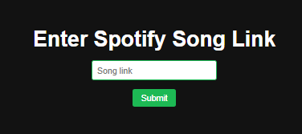
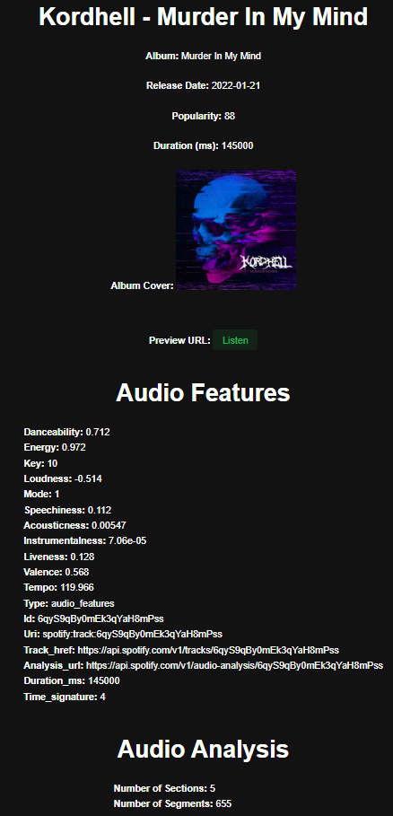

## Spotify Song Info Web App

This is a Flask web application that retrieves information about a Spotify song using its track link. It utilizes the Spotify API to fetch details such as artist, track name, album, release date, popularity, duration, album cover URL, preview URL, audio features, and audio analysis.

### Screenshots





### Requirements

The following packages are required to run this application. You can install them using `pip` by running:

```bash
pip install -r requirements.txt
```

- os
- pandas
- Flask
- spotipy

### Usage

1. Obtain your Spotify API credentials (client ID and client secret) from the [Spotify Developer Dashboard](https://developer.spotify.com/dashboard/).
2. Clone or download this repository.
3. Install the required packages using the command mentioned in the requirements section.
4. Replace the `client_id` and `client_secret` variables in the code with your own Spotify API credentials.
5. Run the Flask application using the following command:

   ```bash
   python app.py
   ```

6. Access the web application by visiting `http://localhost:5000` in your web browser.
7. Enter a valid Spotify track link in the provided input field and click the "Get Info" button.
8. The application will display the retrieved song information on the dashboard page.

### License

This project is licensed under the [MIT License](LICENSE).